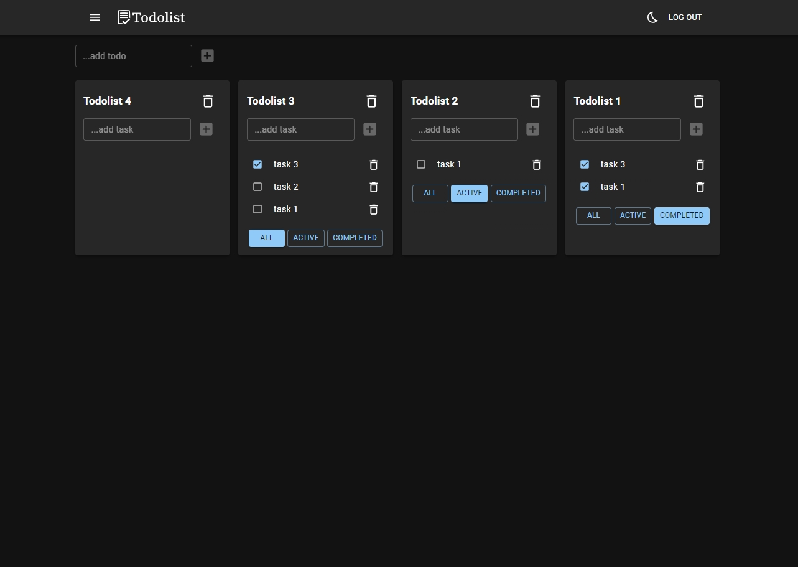
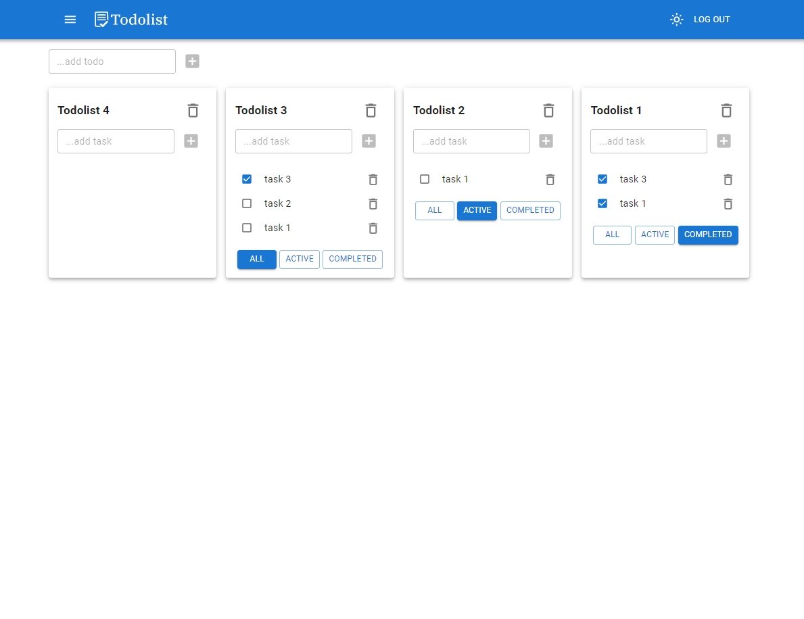

# React Todolist

  

    
    

### Links:

> [Todolist](https://skate090961.github.io/react-todolist/) - web application

### Description:

In this application, you can create various lists that have nested tasks. Each task can be described in detail by adding deadlines, description, priority and status.
In the application, you can log in using a test account or follow the link to register your own. All login information is provided on the login page.

## Tech Stack:

- React
- TypeScript
- Redux, Redux-Thunk
- Axios
- CSS modules
- Jest
- React-hook-form
- Material UI
- Storybook
- React-router-dom
